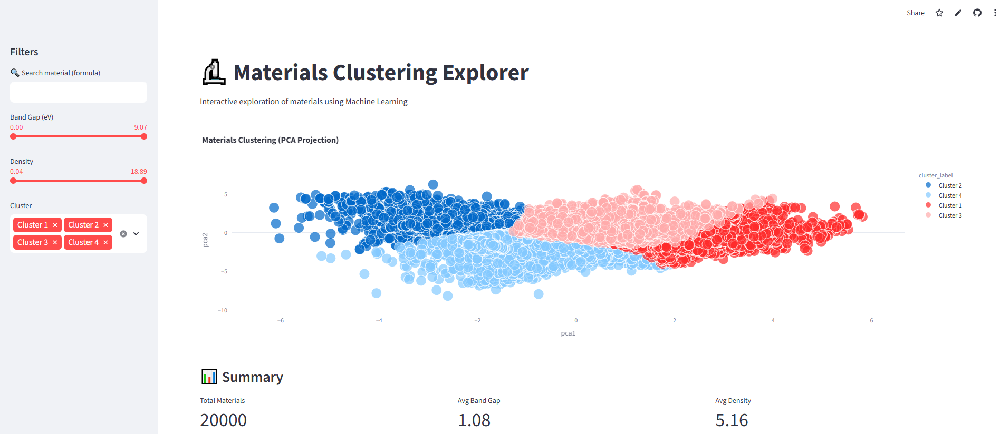

# 🔬 Materials Clustering & Exploration App

🚀 **Live Demo:** [Open the app](https://materials-clustering-ml-vhvktdwhigosihx9pecgce.streamlit.app/)

---

## 📸 App Preview

[](https://materials-clustering-ml-vhvktdwhigosihx9pecgce.streamlit.app/)

---

## 🚀 Project Overview

This project applies machine learning techniques to explore and cluster materials based on their physical properties. It combines data collection, feature engineering, unsupervised learning, and interactive visualization into a complete data science workflow.

---

## 🎯 Business / Scientific Value

This project demonstrates how machine learning can be used to:

- Accelerate materials discovery
- Identify patterns in high-dimensional physical data
- Support decision-making in materials science and engineering

---

## 📊 Key Features

- 🔍 **Data Collection** from Materials Project API  
- 🧹 **Data Cleaning & Preprocessing**  
- ⚙️ **Feature Engineering** (band gap, density, energy, etc.)  
- 🤖 **Unsupervised Learning (KMeans)** to cluster materials  
- 📉 **Dimensionality Reduction (PCA)** for visualization  
- 🎯 **Cluster Interpretation** (metals, semiconductors, insulators)  
- 🌐 **Interactive Web App (Streamlit)** with:
  - Search bar (real-time filtering)
  - Band gap filter
  - Density filter
  - Cluster selection
  - Hover with material properties

---

## 🧠 Machine Learning Approach

- **KMeans Clustering** to group materials based on physical properties  
- **PCA (Principal Component Analysis)** to reduce dimensionality and visualize clusters in 2D  
- Clusters naturally correspond to:
  - Metals  
  - Semiconductors  
  - Insulators  

---

## 🧭 How to Use the App

1. Open the live demo  
2. Use filters (band gap, density) to explore materials  
3. Select clusters to analyze different material groups  
4. Hover over points to see detailed material properties  

---

## 📁 Project Structure

```bash
materials-clustering/
│
├── assets/
│ ├── screenshot1_app.png
│ └── screenshot2_app.png
│
├── data/
│ ├── raw/
│ └── processed/
│
├── notebooks/
│ ├── 01_data_collection.ipynb
│ ├── 02_data_cleaning.ipynb
│ ├── 03_feature_engineering.ipynb
│ ├── 04_eda.ipynb
│ └── 05_clustering.ipynb
│
├── app.py
├── requirements.txt
└── README.md
```

---

## ⚙️ Installation

Clone the repository:

```bash
git clone https://github.com/your-username/materials-clustering.git
cd materials-clustering
```

Install dependencies:

```bash
pip install -r requirements.txt
```

## 🔐 API Key Setup

This project uses the Materials Project API.

Create a .env file:

```bash
MAPI_API_KEY=your_api_key_here
```

Make sure .env is included in .gitignore.

## ▶️ Run the App

```bash
streamlit run app.py
```

Then open the local URL in your browser.

## 📊 Example Output

- Clustering of materials in PCA space
- Interactive exploration of materials
- Identification of physical groups based on properties

## 🧪 Technologies Used
- Python
- Pandas
- NumPy
- Scikit-learn
- Plotly
- Streamlit

## 💡 Key Insights

- Materials can be grouped into meaningful clusters using physical properties
- Band gap plays a key role in distinguishing material types
- Unsupervised learning can recover known physical categories without labels

## 📧 Contact
**Nahuel Moreno Yalet**  
  nmyalet@gmail.com

  Data Scientist | PhD in Computational Chemistry